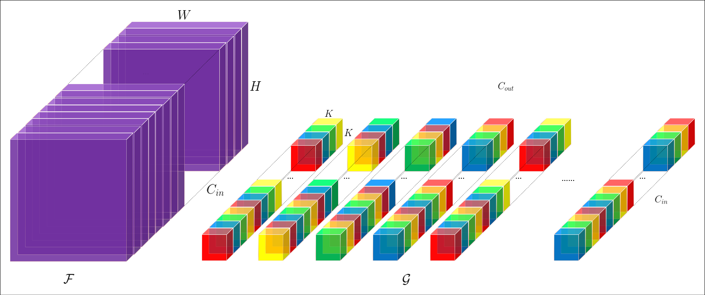

# Poly-Scale Convolution
Official implementation of our PSConv operator as described in [PSConv: Squeezing Feature Pyramid into One Compact Poly-Scale Convolutional Layer](https://arxiv.org/abs/2007.06191) (ECCV'20) by  [Duo Li](https://github.com/d-li14), [Anbang Yao](https://github.com/YaoAnbang) and [Qifeng Chen](https://github.com/CQFIO) on the [MS COCO 2017](https://cocodataset.org) benchmark.

<p align="center"></p>

We collect multi-scale feature representations in a finer granularity, by tactfully allocating a spectrum of dilation rates in the kernel lattice.

## Getting Started

### Installation

Following the instructions from [INSTALL.md](INSTALL.md) for installation. More detailed guidance can be found from [MMDetection](https://github.com/open-mmlab/mmdetection).


### Download ImageNet pre-trained checkpoints

Fetch pre-trained weights of [PS-ResNet-50](https://drive.google.com/file/d/155pB1vci62zQV6AmY4MsCw5zLL0qYmG4/view?usp=sharing), [PS-ResNet-101](https://drive.google.com/file/d/15kgctzliEguQHihJoNeG65Vld9DGEITV/view?usp=sharing) and [PS-ResNeXt-101 (32x4d)](https://drive.google.com/file/d/1dbttT3PvILRQvA9f0nKCLvQNg1a2QsVD/view?usp=sharing) backbones and put them to your local path. Set the `pretrained` path of config file and launch the training of detectors.

### Training

The default learning rate in config files is for 8 GPUs and 2 img/GPU (batch size = 8*2 = 16).
According to the [Linear Scaling Rule](https://arxiv.org/abs/1706.02677), you need to set the learning rate proportional to the batch size if you use different GPUs or images per GPU, e.g., lr=0.01 for 4 GPUs * 2 img/gpu and lr=0.08 for 16 GPUs * 4 img/GPU.

```shell
# single-gpu training
python tools/train.py ${CONFIG_FILE}

# multi-gpu training
./tools/dist_train.sh ${CONFIG_FILE} ${GPU_NUM} [optional arguments]
```

Optional arguments are:

- `--validate` (**strongly recommended**): Perform evaluation at every k (default value is 1) epochs during the training.
- `--work_dir ${WORK_DIR}`: Override the working directory specified in the config file.
- `--resume_from ${CHECKPOINT_FILE}`: Resume from a previous checkpoint file.

### Test

```shell
# single-gpu testing
python tools/test.py ${CONFIG_FILE} ${CHECKPOINT_FILE} [--out ${RESULT_FILE}] [--eval ${EVAL_METRICS}] [--show]

# multi-gpu testing
./tools/dist_test.sh ${CONFIG_FILE} ${CHECKPOINT_FILE} ${GPU_NUM} [--out ${RESULT_FILE}] [--eval ${EVAL_METRICS}]
```

Optional arguments:
- `RESULT_FILE`: Filename of the output results in pickle format. If not specified, the results will not be saved to a file.
- `EVAL_METRICS`: Items to be evaluated on the results. Allowed values are: `proposal_fast`, `proposal`, `bbox`, `segm`, `keypoints`.
- `--show`: If specified, detection results will be ploted on the images and shown in a new window. (Only applicable for single GPU testing.)


## Model Zoo

### Faster R-CNN

| Backbone  |  Style  | Lr schd | box AP |                           Download                           |
| :-------: | :-----: | :-----: | :----: | :----------------------------------------------------------: |
| R-50-FPN  | pytorch |   1x    |  38.4  | [model](https://drive.google.com/file/d/1sXHMMCWD9PS73gBRw-C5KoorjzFCfKkA/view?usp=sharing) &#124; [log](https://drive.google.com/file/d/1n1a_XB9XclQk3uoJJ2R3mojytqH3ccTx/view?usp=sharing) |
| R-101-FPN | pytorch |   1x    |  40.9  | [model](https://drive.google.com/file/d/1NV2dPYBb8lnDS75we0u-qHnPP_pfI6DG/view?usp=sharing) &#124; [log](https://drive.google.com/file/d/17yvoUtn9KqEPTwOUfT1Ucwyqt2ZraD60/view?usp=sharing) |
| X-101-FPN | pytorch |   1x    |  41.3  | [model](https://drive.google.com/file/d/1Hct7d_OrVMP2LZmgMu0DncY1NpCpS_E2/view?usp=sharing) &#124; [log](https://drive.google.com/file/d/1FKInWaI15Q-6ra_86gvNjTeIW7TjKE7b/view?usp=sharing) |

### Mask R-CNN

|    Backbone     |  Style  | Lr schd | box AP | mask AP | Download |
| :-------------: | :-----: | :-----: | :----: | :-----: | :----------------: |
|    R-50-FPN     | pytorch |   1x    |  39.4  |  35.6  | [model](https://drive.google.com/file/d/1cuXnMNQbv_B3nKEWnstbOJRPdMRu9twn/view?usp=sharing) &#124; [log](https://drive.google.com/file/d/1_9Oho9eRc23eAuZ_bD_MaYhcoRtRJRjP/view?usp=sharing) |
|    R-101-FPN    | pytorch |   1x    |  41.6  |  37.4  | [model](https://drive.google.com/file/d/1U5G4uyb5DM-1NS06qOEzCVyEAaDxcvRL/view?usp=sharing) &#124; [log](https://drive.google.com/file/d/17piYzxwPmZCTiiJTLdrdd6phgA1f4X22/view?usp=sharing) |
|    X-101-FPN    | pytorch |   1x    |  42.4  |  38.0  | [model](https://drive.google.com/file/d/1B0GV_PeXDz4_O0iM57GbWSUBXwExZdAs/view?usp=sharing) &#124; [log](https://drive.google.com/file/d/1qD3yW_On8hbcnYyuzKRYTRMNe3QaonRk/view?usp=sharing) |

### Cascade R-CNN

| Backbone  |  Style  | Lr schd | box AP |                           Download                           |
| :-------: | :-----: | :-----: | :----: | :----------------------------------------------------------: |
| R-50-FPN  | pytorch |   1x    |  41.9  | [model](https://drive.google.com/file/d/13i8U-QOpFBhIUndqgYjpH6sD5ram6LFP/view?usp=sharing) &#124; [log](https://drive.google.com/file/d/1q_Vk-9XJDlHAd9m8vFLa1GV8Dtc_WbPU/view?usp=sharing) |
| R-101-FPN | pytorch |   1x    |  43.8  | [model](https://drive.google.com/file/d/1bOWvZfwttuiAjNZhOJin_afji4X1P5Vx/view?usp=sharing) &#124; [log](https://drive.google.com/file/d/1fHAXuuszNsnX9yBaBXP6k_Bni8VrHNFp/view?usp=sharing) |
| X-101-FPN | pytorch |   1x    |  44.4  | [model](https://drive.google.com/file/d/1yCWeqSEjCawlOxMWb0GQmkjPiVMDBTqL/view?usp=sharing) &#124; [log](https://drive.google.com/file/d/1n2MvM_Uaz64JQJqlPVJ2CZycRzb6eYEq/view?usp=sharing) |

### Cascade Mask R-CNN

|    Backbone     |  Style  | Lr schd | box AP | mask AP | Download |
| :-------------: | :-----: | :-----: | :----: | :-----: | :----------------: |
|    R-50-FPN     | pytorch |   1x    |  42.9  |  36.9  | [model](https://drive.google.com/file/d/1L6Ai18CzQ_qcDzSUZEVnOVTQNR_wR9TL/view?usp=sharing) &#124; [log](https://drive.google.com/file/d/1xoKm7Fx3wsShr_LFPNpDtxH0ajHLPyAz/view?usp=sharing) |
|    R-101-FPN    | pytorch |   1x    |  44.6  |  38.4  | [model](https://drive.google.com/file/d/1oB0p7HkD2MjNjj75xHYbBDNg90PxG09G/view?usp=sharing) &#124; [log](https://drive.google.com/file/d/1XdhV6OOVX4m2vUCKnw4heWhHwwFYGJcK/view?usp=sharing) |
|    X-101-FPN    | pytorch |   1x    |  45.3  |  38.9  | [model](https://drive.google.com/file/d/1NDaDe2prI_K5Rvgg9g3x3DjWDG8i0N5V/view?usp=sharing) &#124; [log](https://drive.google.com/file/d/1dLssd97Xv0kQIhyzC4BTmSyPKRkn0GN9/view?usp=sharing) |


## Acknowledgement

This implementation is built upon [MMDetection](https://github.com/open-mmlab/mmdetection). Thanks [Kai Chen](https://github.com/hellock) for releasing this awesome toolbox and his helpful discussions.

Since this project is finished nearly one year ago, we adapt our code from an early commit [713e98b](https://github.com/open-mmlab/mmdetection/commits/713e98bc1bfb842760df6be73b9520ee775d3c06).

## Citation

If you find our work useful in your research, please consider citing:

```bibtex
@InProceedings{Li_2020_ECCV,
author = {Li, Duo and Yao, Anbang and Chen, Qifeng},
title = {PSConv: Squeezing Feature Pyramid into One Compact Poly-Scale Convolutional Layer},
booktitle = {The European Conference on Computer Vision (ECCV)},
month = {August},
year = {2020}
}
```

